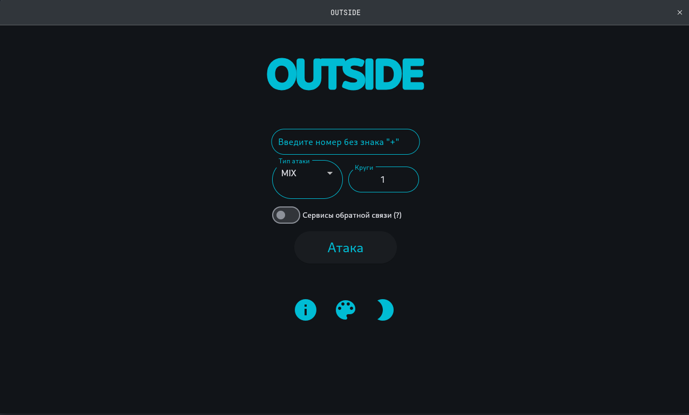

<div align="center">



# 💣 OUTSIDE BOMBER

**Мощный, кроссплатформенный SMS/CALL/FEEDBACK бомбер с графическим и web интерфейсом! Более 330+ рабочих сервисов!** Благодаря асинхронной работе, данный бомбер не только мощный, но и быстрый! Уникальной особенностью является наличие типа атаки **FEEDBACK**!<br><br>

На данный момент, бомбер отлично спамит на номера таких стран как **Россия** и **Узбекистан**, а также есть сервисы и для других стран! В будущем планируется добавить сервисы всех стран СНГ!
<br><br><br>
**Используйте этот скрипт исключительно в образовательных целях, избегая злоупотребления. Вы полностью несете ответственность за любое его использование!**

</div>

# 🐧 Linux
## Установка
```bash
git clone https://github.com/lnkssr/OUTSIDE && cd OUTSIDE && pip3 install -r requirements.txt
```
## Запуск с графическим интерфейсом
```bash
python3 GUI.py
```
## Запуск с web интерфейсом
```bash
python3 WEB.py
```

# 💻 Windows
## Установка
- Для использования OUTSIDE на Windows, у Вас есть два варианта:
  - Использовать скрипт, по аналогии с [Linux](#-linux). Для этого способа требуется установить [Python](https://www.python.org)!

# 📱 Android
## Подготовка
- Для использования OUTSIDE на Android требуется установить [Termux](https://github.com/termux/termux-app/releases)!
- Откройте Termux и введите следующие команды:
```bash
pkg update && pkg upgrade -y && pkg install -y python git
```
## Установка
```bash
git clone https://github.com/lnkssr/OUTSIDE && cd OUTSIDE && pip3 install -r requirements.txt
```
## Запуск с web интерфейсом
```bash
python WEB.py
```
# 🛠 CLI Интерфейс
Для использования CLI интерфейса, выполните следующую команду:

```bash
python CLI.py -n NUMBER -r ROUNDS -t {MIX,SMS,CALL} [-f] [-i]
```

### Параметры:
- `-n NUMBER` или `--number NUMBER`: **(обязательный)** Номер телефона, на который будет осуществляться атака.
- `-r ROUNDS`: **(опциональный)** Количество раундов (по умолчанию 1).
- `-t {MIX,SMS,CALL}`: **(обязательный)** Тип атаки, который вы хотите использовать (MIX, SMS или CALL).
- `-f`: **(опциональный)** Использовать сервисы обратной связи.
- `-i`: **(опциональный)** Получить информацию о доступных сервисах.

### Пример использования:
```bash
python CLI.py -n 1234567890 -r 5 -t SMS
```

# Информация о первоначальном авторе бомбера
- **Telegram канал автора оригинального бомбера (автор форка "outside" не имеет отношения к этому отношения") ~> [КЛИК](https://t.me/+z4L61XedSVllODAy). Подписка на него - самая лучшая поддержка и мотивация продолжать данный проект 💜**
- **[Владелец](https://t.me/A_KTO_Tbl)**
- **[DonationAlerts](https://www.donationalerts.com/r/OUTSIDE_forever)**
Ы